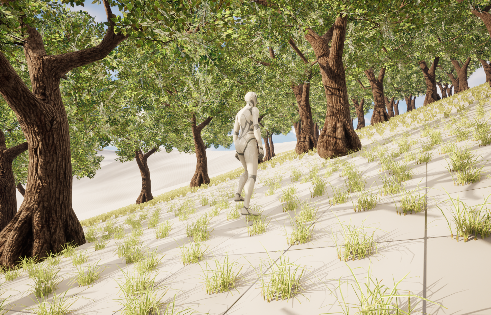
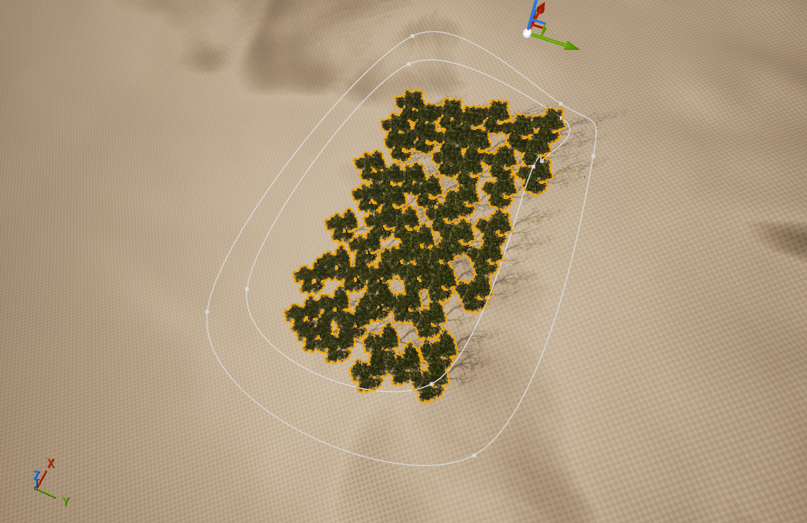
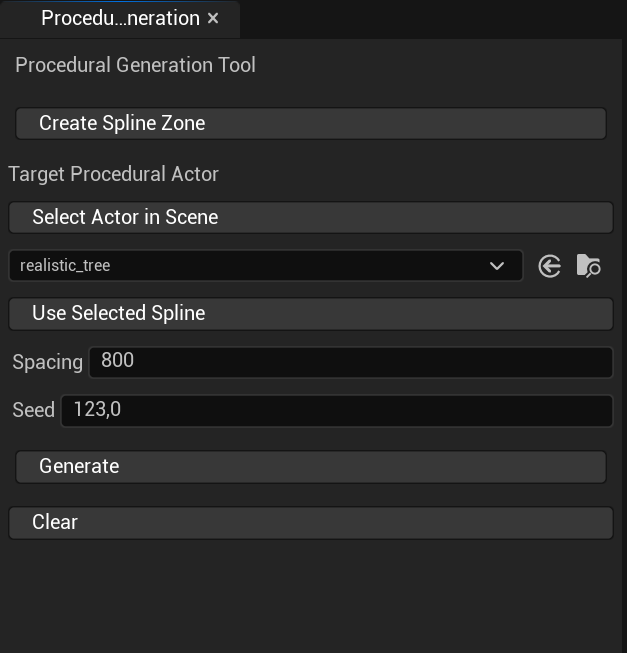

# Procedural Spline Placement Tool

## Overview

This project provides a **procedural object placement system based on spline-defined areas** inside Unreal Engine.

It allows you to spawn meshes inside a custom shape drawn with a spline, using **Poisson Disk Sampling** to ensure an even and natural distribution of objects.

The tool is fully editor-driven and designed to be flexible, reusable, and efficient for level design workflows.

---

## Features

- Procedural placement inside spline-defined areas
- Even distribution using Poisson Disk Sampling
- Deterministic generation using a seed
- Supports uneven terrain and landscapes
- Uses Instanced Static Meshes for performance
- Multiple spline areas supported
- Custom Editor UI

---

## Installation

1. Install the plugin into your project's `Plugins` folder
2. Enable the plugin in **Edit → Plugins**
3. Restart the editor if required

---

## How to Use

### 1. Open the Procedural Generation UI

In the Unreal Editor menu bar: Windows → Procedural Generation

This opens the editor interface used to control the generation.

---

### 2. Create a Generator Actor

1. Create a new **Actor** in your level
2. Add the following component to it: SplineComponentPG

3. Use the spline component to **draw the area** where objects should be generated

⚠️ The spline must form a **closed shape** for the generation to work correctly.

---

### 3. Bind the Generator Actor

1. Select the generator **Actor** in the level
2. In the Procedural Generation UI, click: Get Actor

This assigns the selected actor as the generation actor.

---

### 4. Bind the Spline Component (Important)

1. In the **Details panel**, select the **SplineComponentPG component itself**
   - ⚠️ Do **not** select the actor, the component must be selected
2. In the Procedural Generation UI, click: Get Spline Component

This binds the spline used for procedural generation.

---

### 5. Configure Generation Parameters

In the Procedural Generation UI, set the following parameters:

- **Spacing**  
  Minimum distance between spawned objects.  
  Lower values increase density, higher values reduce the number of objects.

- **Seed**  
  Controls randomness in a deterministic way.  
  - Same seed → same result  
  - Different seed → different distribution  
  Useful for iteration while keeping reproducible results.

- **Mesh**  
  The Static Mesh that will be spawned inside the spline area.

---

### 6. Generate Objects

Click: Generate

This removes all generated instances inside the currently selected spline.

This allows fast iteration without manually cleaning the level.

---

## Using Multiple Splines

You can generate different elements in different areas:

1. Select another **SplineComponentPG**
2. Click **Get Spline Component**
3. Change mesh, spacing, seed, etc.
4. Click **Generate**

This allows multiple spline areas with different procedural settings in the same level.

---

## Notes & Best Practices

- Always select the **SplineComponent**, not the actor, before binding it
- Very large splines with small spacing values may increase generation time
- Instanced Static Meshes ensure good runtime performance
- Generation supports landscapes and uneven terrain

---

## Technical Details

- Distribution algorithm: **Poisson Disk Sampling**
- Placement space: 2D polygon defined by a spline
- Height projection: Line trace against world geometry
- Rendering: `UInstancedStaticMeshComponent`

